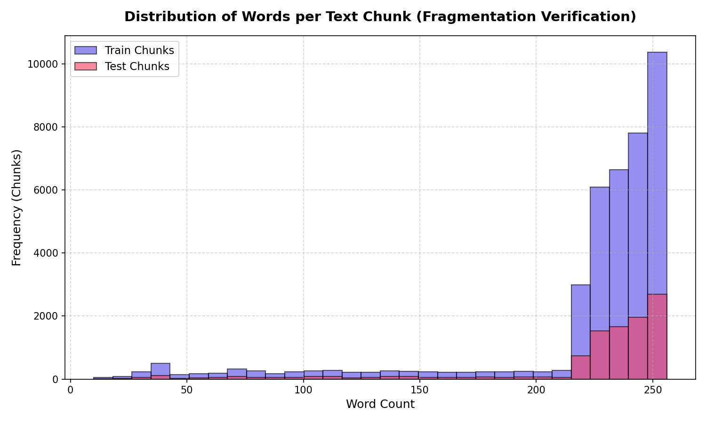
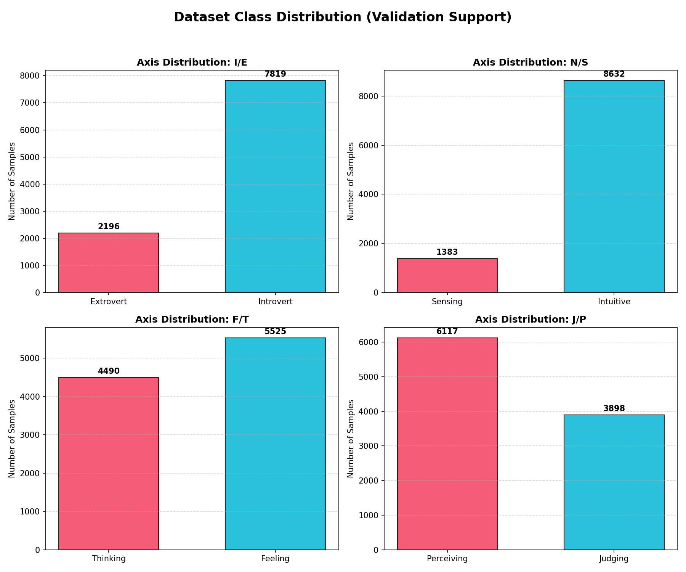
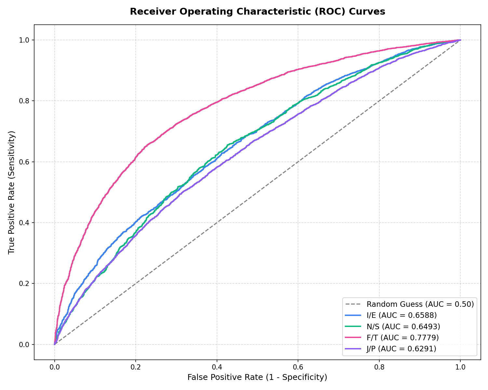
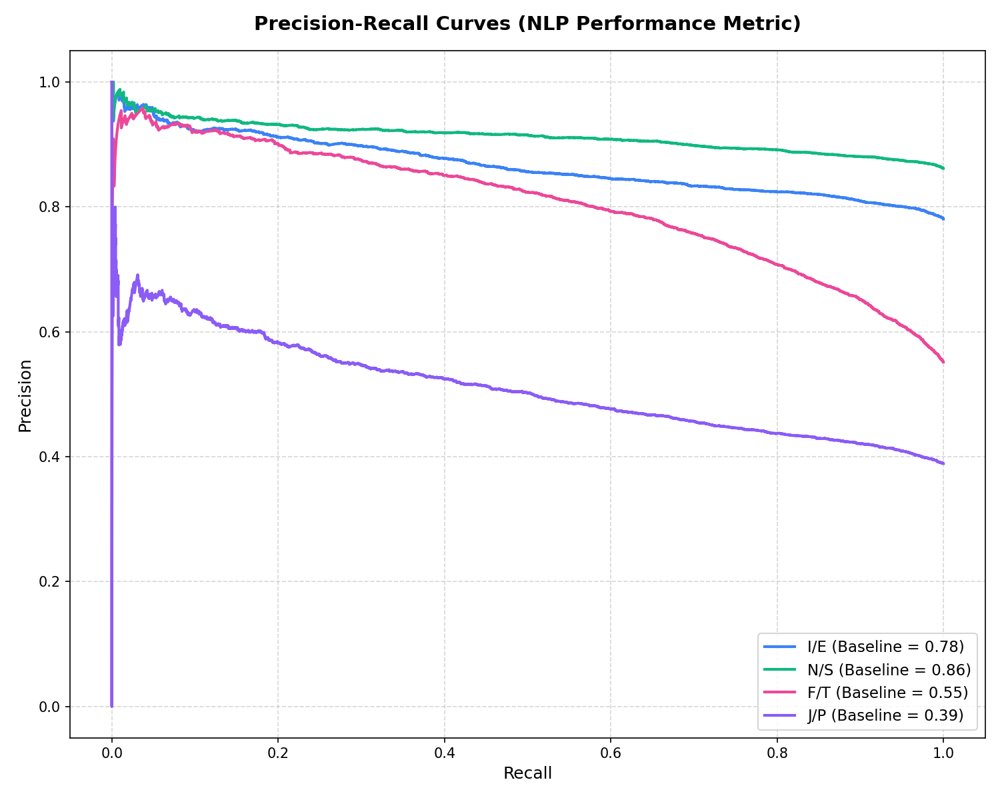
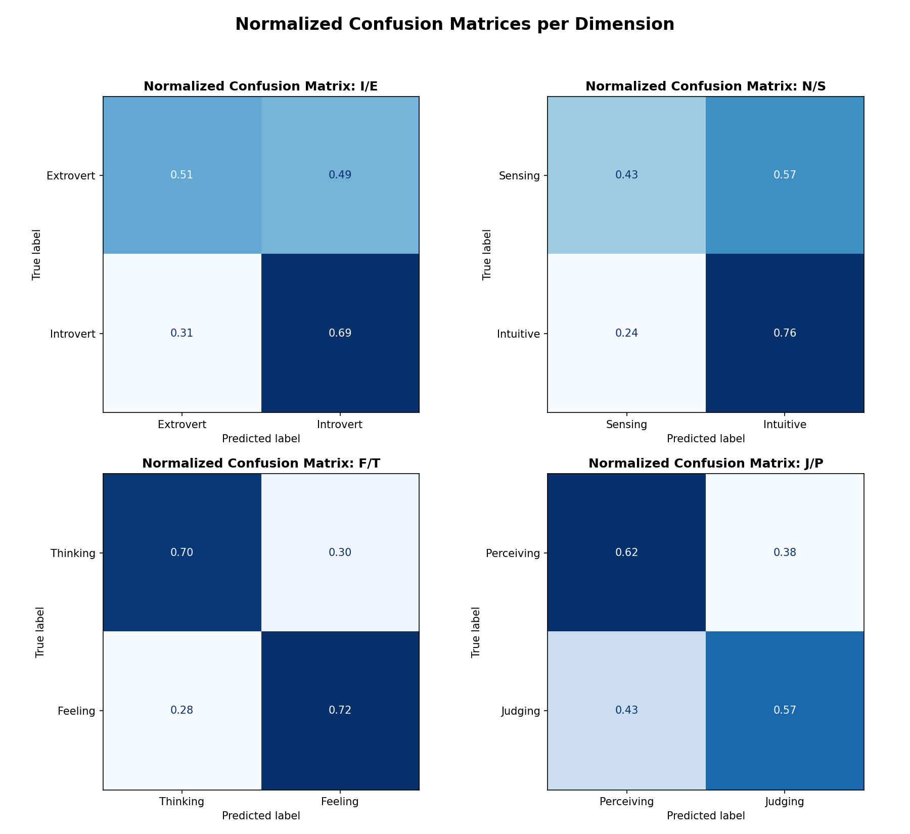
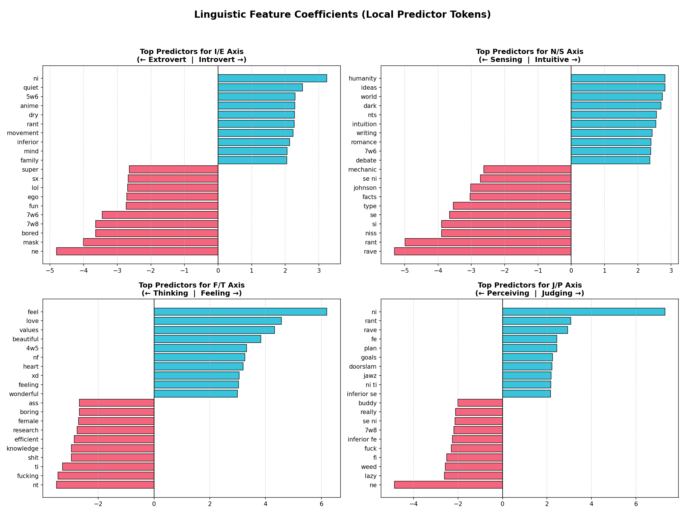

# PsychoNLP: Explainable NLP-Based MBTI Personality Classifier

PsychoNLP is an interactive web application that diagnoses Myers-Briggs Type Indicator (MBTI) personality profiles through natural language processing (NLP). The system uses machine learning classifiers trained on online forum posts to predict a user's cognitive preferences along the four Jungian axes: Introversion vs. Extroversion, Intuition vs. Sensing, Feeling vs. Thinking, and Judging vs. Perceiving.

Designed with a premium glassmorphic theme, the application prioritizes **Explainable AI (XAI)**, showing the exact linguistic markers (words) that influenced its predictions and suggesting alternative personality archetypes for borderline cases.

---

## 🌌 System Architecture Flow

The following diagram illustrates the lifecycle of the system, including dataset preparation, model training, and the runtime web application inference loop.

```mermaid
graph LR
    %% Set the overall flow from Left to Right (puts subgraphs side-by-side)
    
    %% Dataset Prep and Training Pipeline
    subgraph Data Pipeline & Training [Data Pipeline & Training]
        direction TB
        A[dataset/mbti_2.csv] --> B[User-Level Train/Test Split]
        B -->|Train Users| C1(Linguistic Preprocessing & Keyword Masking)
        B -->|Test Users| C2(Linguistic Preprocessing & Keyword Masking)
        C1 --> D1[256-Word Text Chunking]
        C2 --> D2[256-Word Text Chunking]
        D1 --> E[TF-IDF Fit & Transform]
        D2 --> F[TF-IDF Transform Only]
        E --> G[Save Vectorizer]
        E --> H[Train 4x Binary Logistic Regression Classifiers]
        H --> I[Evaluate on Test TF-IDF Matrix]
        H --> J[Save MBTI Models]
    end

    %% Inference Web Application
    subgraph Web App Inference Loop [Web App Inference Loop]
        direction TB
        K[User UI Input: Free Text / Guided Prompts] --> L[Flask /api/predict]
        L --> M(Preprocess & MASK Input Text)
        M --> N[TF-IDF Transform]
        N --> O[Predict Axis Probabilities]
        O --> P[Calculate Diagnostic Confidence & Word Influence]
        P --> Q{"Confidence < 22&#37; & Guided Step < 3?"}
        Q -->|Yes| R[Dynamic Follow-up Topic Trigger]
        R --> K
        Q -->|No| S[Compute Borderline Alternate Types via Cartesian Product]
        S --> T[Render Glassmorphic Diagnosis Dashboard]
    end
    
    %% Optional: This invisible link ensures they sit nicely side-by-side on Github
    J ~~~ K
```



---

## 🔬 Scientific Methods & Machine Learning Implementation

Building a personality classifier from social media text involves several psycholinguistic challenges. PsychoNLP addresses these using rigorous machine learning methodologies.

### 1. Data Leakage Mitigation (Keyword Masking & User-Level Splitting)
*   **Target Keyword Masking (`[MASK]`):** In self-reported personality datasets, users frequently mention MBTI types (e.g., *"As an INFJ, I struggle with..."*). If left in the training data, a model will simply memorize that the token `infj` correlates 100% with the INFJ label. This creates **circular logic/target leakage**, meaning the model fails to learn the underlying style of writing and instead becomes a simple keyword finder. PsychoNLP uses a regular expression compiled at startup (`MASK_REGEX`) to replace all 16 MBTI type mentions (and their plurals) with `[MASK]`.
*   **User-Level Train-Test Split:** A user's writing is highly consistent across multiple posts. If we chunked the entire dataset first and then split into train/test groups, chunks from the *same user* would end up in both training and testing sets. The model would easily identify the user's specific vocabulary and context, leading to artificially inflated accuracy metrics that fail to generalize to new users. PsychoNLP executes `train_test_split` on the raw user profiles **before** chunking them into shorter text fragments.

### 2. Document Fragmentation (256-Word Text Chunking)
In the raw dataset, user posts are concatenated and delimited by `|||`. Because document length variability is a major source of bias in TF-IDF (which is sensitive to document length despite sublinear scaling), PsychoNLP implements a text-chunking algorithm:
*   Posts are parsed, cleaned, and grouped into chunks of approximately **256 words**.
*   This matches academic psycholinguistic literature (e.g., Plank & Hovy, Gjurković & Šnajder), which shows that 256-word fragments provide an optimal balance between lexical density and dataset size, effectively multiplying the training samples while keeping document lengths uniform.

### 3. Dimensional Orthogonal Modeling (4-Axis Paradigm)
Instead of predicting one of 16 classes directly (which suffers from severe data sparsity), MBTI is modeled as **four independent binary classification tasks**:
1.  **Introversion (I) vs. Extroversion (E)** (Class 1 = Introvert, Class 0 = Extrovert)
2.  **Intuition (N) vs. Sensing (S)** (Class 1 = Intuitive, Class 0 = Sensing)
3.  **Feeling (F) vs. Thinking (T)** (Class 1 = Feeling, Class 0 = Thinking)
4.  **Judging (J) vs. Perceiving (P)** (Class 1 = Judging, Class 0 = Perceiving)

This axis-based approach matches the core theoretical framework of MBTI, which posits that the four scales represent separate, orthogonal cognitive functions. Mathematically, this reduces the entropy of the classification target and allows for denser class distributions.

### 4. Handling Class Imbalance
Online personality databases are heavily skewed towards specific types (for example, intuitive types `N` are overrepresented on forums compared to their actual general population rates). To prevent the classifiers from biasing towards the majority class:
*   We use **Logistic Regression** initialized with `class_weight='balanced'`.
*   This adjusts the loss function's penalty inversely proportional to class frequencies, forcing the model to pay higher attention to minority classes (such as Sensing `S`).

### 5. Local Feature Attribution (Explainable AI)
For any input text, PsychoNLP computes the mathematical influence of each word on each axis.
The influence of a word $w$ is defined as:

$$\text{Influence}(w) = \text{TF-IDF}(w) \times \beta_w$$

where:
*   $\text{TF-IDF}(w)$ is the term frequency-inverse document frequency weight of the word in the input document.
*   $\beta_w$ is the coefficient weight assigned to word $w$ by the trained Logistic Regression model.

Words with positive weights push the prediction towards the **positive class** (Introversion, Intuition, Feeling, Judging), while words with negative weights pull the prediction towards the **negative class** (Extroversion, Sensing, Thinking, Perceiving). The top 5 words matching each category are extracted and rendered as visual tags in the dashboard.

### 6. Boundary-Level Ambiguity Resolution
Psychological traits are continuous, not discrete binary states. When a user's probability estimate falls close to the 50% decision boundary, classifying them as strictly one trait over the other is scientifically inaccurate.
*   PsychoNLP introduces a **5% decision margin** around the threshold $[45\%, 55\%]$.
*   If a user's score on a dimension falls within this margin, the system labels both traits as probable.
*   It then calculates the Cartesian product of all possible variations to suggest **Alternative Personality Tendencies** alongside the primary diagnosis.

---

## 🛠️ File Structure

*   [app.py](file:///d:/UNUD/Kuliah%20Informatika/smt%204/PKB/tugasFinal/app.py): Flask application managing UI rendering, guided mode state, and inference APIs.
*   [training.py](file:///d:/UNUD/Kuliah%20Informatika/smt%204/PKB/tugasFinal/training.py): Model training pipeline including preprocessing, text chunking, data-splitting, TF-IDF vectorization, evaluation, and serialized model exports.
*   [templates/index.html](file:///d:/UNUD/Kuliah%20Informatika/smt%204/PKB/tugasFinal/templates/index.html): The interactive dashboard frontend built with Outfit and Space Grotesk typography, featuring a futuristic glassmorphic UI.
*   [static/style.css](file:///d:/UNUD/Kuliah%20Informatika/smt%204/PKB/tugasFinal/static/style.css): Custom CSS styles for glassmorphism, nebula effects, space backgrounds, responsive layouts, progress indicators, and tag chips.
*   [static/app.js](file:///d:/UNUD/Kuliah%20Informatika/smt%204/PKB/tugasFinal/static/app.js): Application logic handling dynamic view switching, topic loading, dialogue looping based on confidence scores, and visual dashboard rendering.

---

## 🚀 Getting Started

### Prerequisites
*   Python 3.8 or higher
*   PIP (Python Package Installer)

Install required dependencies:
```bash
pip install flask joblib scikit-learn numpy
```

### 1. Training the Model
To train the model and output serialization artifacts, ensure you have the dataset located at `dataset/mbti_2.csv`. Then run:

```bash
python training.py
```

The script will:
1.  Load and clean the dataset.
2.  Perform a user-level train/test split.
3.  Vectorize the text using TF-IDF.
4.  Train four binary classifiers.
5.  Print evaluation reports (Accuracy, F1, AUC-ROC) and print top coefficient words for each dimension.
6.  Save `mbti_models.joblib` and `tfidf_vectorizer.joblib`.

### 2. Running the Web Application
Once the serialized models are saved, start the Flask local server:

```bash
python app.py
```

Open your web browser and navigate to `http://127.0.0.1:5000` to interact with the interface.

---

## 📊 Dataset Division (Train vs. Validation/Test)

To ensure the model is evaluated on completely unseen writing styles, the dataset is split at the **user level** before text chunking is performed:

*   **Total Raw Profiles:** 8,675 unique users (split 80% train / 20% test).
*   **Training Dataset:** **39,628 chunks** (derived from 6,940 training users).
*   **Validation / Test Dataset:** **10,015 chunks** (derived from 1,735 testing users).

This corresponds to a training-to-validation ratio of approximately **4:1** at both the user and text fragment level.

---

## 🔬 Model Performance Metrics

The evaluation below details how each binary classifier performed on the **10,015 unseen validation chunks**:

| Trait Axis | Positive Class (1) | Negative Class (0) | Validation Accuracy | F1-Score | AUC-ROC | Validation Support (Class 0 / 1) |
| :--- | :--- | :--- | :---: | :---: | :---: | :---: |
| **I / E** | Introversion (I) | Extroversion (E) | **65.36%** | 75.78% | 65.88% | 2,196 (E) / 7,819 (I) |
| **N / S** | Intuition (N) | Sensing (S) | **71.85%** | 82.41% | 64.93% | 1,383 (S) / 8,632 (N) |
| **F / T** | Feeling (F) | Thinking (T) | **71.20%** | 73.35% | 77.79% | 4,490 (T) / 5,525 (F) |
| **J / P** | Judging (J) | Perceiving (P) | **59.71%** | 52.22% | 62.91% | 6,117 (P) / 3,898 (J) |

### 📈 Insights on Model Performance

1.  **Class Imbalance and `class_weight='balanced'`:**
    The dataset shows severe skews, particularly on the **Intuition (N) vs. Sensing (S)** axis (86% Intuitive) and the **Introvert (I) vs. Extrovert (E)** axis (78% Introverted). By using balanced class weights, the logistic regression model adjusts penalty weights to avoid predicting the majority class (`N` or `I`) for every instance. This maintains reasonable AUC-ROC scores despite the baseline skew.
2.  **Highest Performance (F/T Axis):**
    The **Feeling (F) vs. Thinking (T)** axis exhibits the highest overall quality with an **AUC-ROC of 77.79%** and a balanced 71.20% accuracy. This indicates that thinking-based language (heavy use of logic-oriented terms, technical or objective nouns) and feeling-based language (affective terms, sentiment-rich expressions) are highly distinguishable in text.
3.  **Lowest Performance (J/P Axis):**
    The **Judging (J) vs. Perceiving (P)** axis remains the most challenging, returning a validation accuracy of **59.71%**. In written text, the distinction between planning/structure (J) and spontaneity/adaptability (P) is linguistically subtle, as both types share broad interest groups and vocabulary.

> [!NOTE]
> The performance metrics listed above are calculated using single, isolated 256-word chunks. At runtime, the **Guided Interactive Mode** concatenates multiple responses across topics if confidence is low, boosting total word count and significantly increasing diagnostic accuracy beyond these baseline levels.

> [!IMPORTANT]
> To preserve the explainability features in the web app dashboard, do not rename or remove the serialized `.joblib` files generated by the training pipeline.

---

## 📈 Scientific Analysis Visualizations

After model training, the pipeline generates 6 evaluation plots to analyze the psycholinguistic and machine learning characteristics of the classifiers. The generated graphics are saved in the [static/plots/](file:///d:/UNUD/Kuliah%20Informatika/smt%204/PKB/tugasFinal/static/plots/) directory:

### 1. Word Count Distribution
*   **File Name:** [mbti_chunk_word_counts.png](file:///d:/UNUD/Kuliah%20Informatika/smt%204/PKB/tugasFinal/static/plots/mbti_chunk_word_counts.png)
*   **Purpose:** Verifies the document fragmentation process. It plots a histogram of word counts for both train and test chunks, proving that document lengths are strictly controlled around the target of 256 words to reduce length bias in TF-IDF.
*   **Visual:** 

### 2. Dataset Class Distribution
*   **File Name:** [mbti_class_distribution.png](file:///d:/UNUD/Kuliah%20Informatika/smt%204/PKB/tugasFinal/static/plots/mbti_class_distribution.png)
*   **Purpose:** Shows the exact sample counts for each class on all 4 axes in the validation set, visually demonstrating the severe class imbalances (specifically on N/S and I/E).
*   **Visual:** 

### 3. Receiver Operating Characteristic (ROC) Curves
*   **File Name:** [mbti_roc_curves.png](file:///d:/UNUD/Kuliah%20Informatika/smt%204/PKB/tugasFinal/static/plots/mbti_roc_curves.png)
*   **Purpose:** Evaluates the diagnostic sensitivity (True Positive Rate) against 1 - specificity (False Positive Rate) across all probability thresholds, displaying the AUC value for each model.
*   **Visual:** 

### 4. Precision-Recall Curves
*   **File Name:** [mbti_precision_recall_curves.png](file:///d:/UNUD/Kuliah%20Informatika/smt%204/PKB/tugasFinal/static/plots/mbti_precision_recall_curves.png)
*   **Purpose:** Crucial for evaluating models on imbalanced datasets. It shows precision against recall, highlighting how well the models maintain prediction accuracy even at high coverage rates, plotted alongside class ratio baseline limits.
*   **Visual:** 

### 5. Normalized Confusion Matrices
*   **File Name:** [mbti_confusion_matrices.png](file:///d:/UNUD/Kuliah%20Informatika/smt%204/PKB/tugasFinal/static/plots/mbti_confusion_matrices.png)
*   **Purpose:** Displays a 2x2 grid of confusion matrices normalized by row (true class), detailing true negative rates, true positive rates, false positive rates, and false negative rates for each dimension.
*   **Visual:** 

### 6. Linguistic Feature Coefficient Importance
*   **File Name:** [mbti_feature_importance.png](file:///d:/UNUD/Kuliah%20Informatika/smt%204/PKB/tugasFinal/static/plots/mbti_feature_importance.png)
*   **Purpose:** A horizontal bar chart of the top 10 positive and 10 negative coefficients (features/words) for each of the 4 axes. This acts as a global explainability chart showing the core vocabulary the models associated with each cognitive style.
*   **Visual:** 
